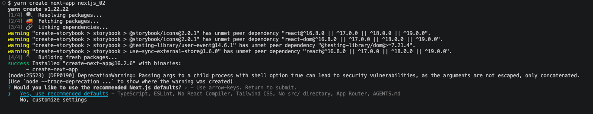
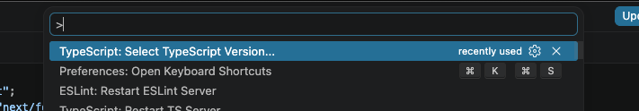
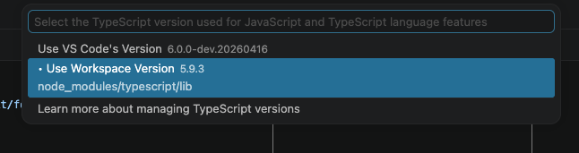
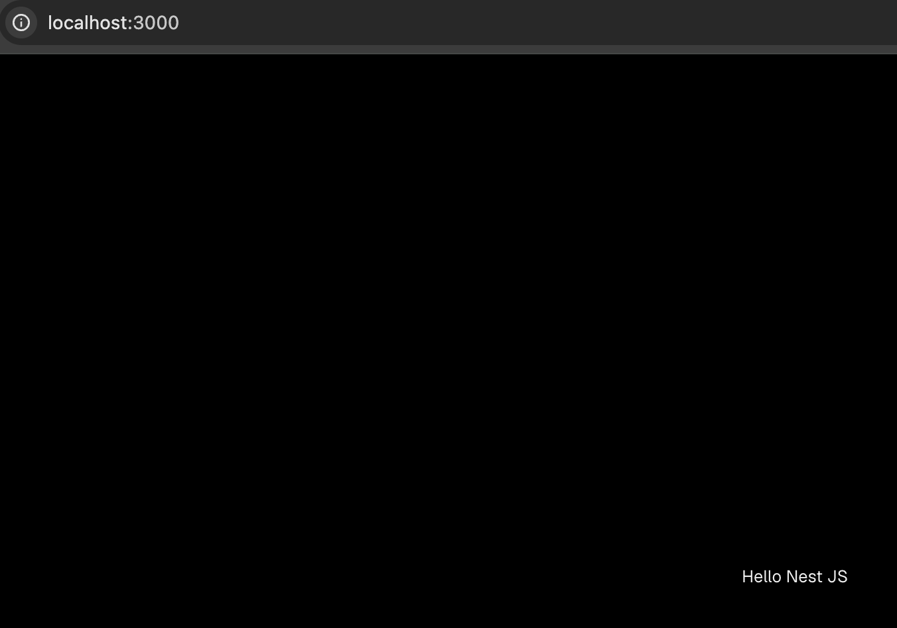

# Next.js App Setup & App Router File Conventions

> **Date:** — | **Session #:** 2 | **Duration:** —
> **Roadmap:** Phase 1 → Project Setup + App Router Basics + File-based Routing
> **Stream:** ✅ Streamed ([YouTube link])

Installing the first Next.js 15 project using `create-next-app`, exploring the structure, understanding what and why in the `app/` directory — `page.tsx`, `layout.tsx`, special files.

## Prerequisites

- Node.js 20+ installed (`node -v`)
- npm / npx available
- VS Code or WebStorm
- minimum TypeScript version 5.1 (for Next.js 15)

## Step 0. Check Node.js version

Check Node.js version:

```bash
node -v
v24.15.0
```

Here I'm going to use yarn instead of npm, but you can choose either:

```bash
npm install -g yarn && yarn --version
1.22.22
```

## Step 1. Create the project

Move to the directory where you want to create the project and run:

In my case, I have a `examples/` folder where I keep all my coding projects:


```bash
yarn create next-app@latest nextjs_01 \
  --typescript \
  --tailwind \
  --eslint \
  --app \
  --import-alias "@/*"
```
or a simpler alternative using defaults:

```bash
yarn create next-app nextjs_01 --yes
```
> --yes skips prompts using saved preferences or defaults. The default setup enables TypeScript, Tailwind CSS, ESLint, App Router, and Turbopack, with import alias @/*, and includes AGENTS.md (with a CLAUDE.md that references it) to guide coding agents to write up-to-date Next.js code.

output:

```bash
- next
- react
- react-dom

Installing devDependencies:
- @tailwindcss/postcss
- @types/node
- @types/react
- @types/react-dom
- eslint
- eslint-config-next
- tailwindcss
- typescript

yarn install v1.22.22
info No lockfile found.
[1/4] 🔍  Resolving packages...
[2/4] 🚚  Fetching packages...
[3/4] 🔗  Linking dependencies...
[4/4] 🔨  Building fresh packages...
success Saved lockfile.
✨  Done in 39.12s.

yarn exec v1.22.22
Generating route types...
✓ Types generated successfully
✨  Done in 2.29s.

Success! Created nextjs_01 at .../nextjs_01

✨  Done in 44.15s.
```

> There is another way to create the project using `CLI` - you can run `yarn create next-app nextjs_01` (without the `--yes` flag) and it will prompt you to choose the options interactively. The `--yes` flag just skips the prompts and uses the default options, which are the same as the ones we specified in the command above.




Then move into the project directory and start the development server:

```bash
cd nextjs_01
yarn dev
```
output:

```bash
yarn run v1.22.22
$ next dev
▲ Next.js 16.2.6 (Turbopack)
- Local:         http://localhost:3000
- Network:       http://192.168.178.21:3000
✓ Ready in 420ms
```

Open `http://localhost:3000` in the browser — you should see the default Next.js welcome page.


---

## Step 2. IDE Plugin

Next includes a Next.js plugin for VS Code and WebStorm that provides features like auto-imports, route generation, and more. Make sure to install it to enhance your development experience.
> Probably you need to open any ts or tsx file in the `app/` directory to trigger the plugin features.
Open the command palette (Ctrl+Shift+P) and search for "TypeScript: Select TypeScript Version"

Select "Use Workspace Version" to ensure you're using the TypeScript version specified in your project (which is required for Next.js 15 features).


Then Set up linting

Next.js comes with ESLint configured out of the box. You can customize the ESLint rules by editing the `eslint.config.mjs` file in your project. Make sure to install the ESLint extension in your IDE to get real-time linting feedback as you code.

after installing Prettier

```bash
yarn add --dev prettier eslint-config-prettier
```

Then create a `.prettierrc` file in the root of your project with your preferred Prettier configuration:

```bash
touch .prettierrc
```

```json
{
  "semi": true,
  "singleQuote": true,
  "trailingComma": "es5"
}
```

or leave it empty to use Prettier's default settings.

```json
{}
```

then update your `eslint.config.mjs` to include Prettier:

```javascript {4,9}
import { defineConfig, globalIgnores } from "eslint/config";
import nextVitals from "eslint-config-next/core-web-vitals";
import nextTs from "eslint-config-next/typescript";
import prettier from "eslint-config-prettier/flat";

const eslintConfig = defineConfig([
  ...nextVitals,
  ...nextTs,
  prettier,
  // Override default ignores of eslint-config-next.
  globalIgnores([
    // Default ignores of eslint-config-next:
    ".next/**",
    "out/**",
    "build/**",
    "next-env.d.ts",
  ]),
]);

export default eslintConfig;
```

and add scripts to `package.json`:

```json {6-8}
"scripts": {
  "dev": "next dev",
  "build": "next build",
  "start": "next start",
  "lint": "eslint",
  "lint:fix": "eslint --fix",
  "format": "prettier --write .",
  "format:check": "prettier --check ."
}
```

and now you can run `yarn lint` to check for linting errors, `yarn lint:fix` to automatically fix linting issues, `yarn format` to format your code with Prettier, and `yarn format:check` to check if your code is formatted according to Prettier's rules.

---

## Step 3. Explore the project structure

By default, the project has the following structure:
```bash
$ tree -I "dist|node_modules|temp|*.log|coverage"
.
├── AGENTS.md
├── CLAUDE.md
├── README.md
├── app
│   ├── favicon.ico
│   ├── globals.css
│   ├── layout.tsx
│   └── page.tsx
├── eslint.config.mjs
├── next-env.d.ts
├── next.config.ts
├── package.json
├── postcss.config.mjs
├── public
│   ├── file.svg
│   ├── globe.svg
│   ├── next.svg
│   ├── vercel.svg
│   └── window.svg
├── tsconfig.json
└── yarn.lock

3 directories, 19 files
```

The main folders and files to note are:
- `app/` — this is where all your application code lives. It contains the routing structure and components for your app.
- `public/` — this is where you put static assets like images, fonts, etc. Files in this folder are served directly at the root URL (e.g., `public/image.png` is accessible at `http://localhost:3000/image.png`).
- `next.config.ts` — this is the configuration file for Next.js where you can customize various aspects of your application.
- `tsconfig.json` — this is the TypeScript configuration file that defines how TypeScript should compile your code.
- `postcss.config.mjs` — this is the configuration file for PostCSS, which is used for processing CSS, including Tailwind CSS in this setup.
- `eslint.config.mjs` — this is the configuration file for ESLint, which is used for linting your JavaScript/TypeScript code to ensure code quality and consistency.
- `AGENTS.md` and `CLAUDE.md` — these files are related to coding agents and provide guidelines for writing up-to-date Next.js code.
- `README.md` — this is the main documentation file for your project where you can provide an overview, setup instructions, and other relevant information about your application.

## Step 4. Set up Absolute Imports

By default, Next.js supports absolut imports and module path aliases.

Let's check how it works. In root of the project create a folder `src/` and create a file `Component.tsx` with the following content:

```typescript
import React from "react";

export const Component: React.FC = () => {
  return <div>Hello Nest JS</div>;
};
```

Then open `src/app/page.tsx` and import the component using the alias:

```typescript
import { Component } from "@/src/Component";

export default function Home() {
  return (
    <div className="flex flex-col flex-1 items-center justify-center bg-zinc-50 font-sans dark:bg-black">
      <Component />
    </div>
  );
}
```

If you run the development server with `yarn dev`, you should see "Hello Nest JS" rendered on the page, confirming that the absolute import is working correctly.



Next, improve the import path by removing the `src/` part or add `baseUrl`. To do this, open `tsconfig.json` and add the following paths configuration:

```json
{
  "compilerOptions": {
    // ... other options ...
    "baseUrl": "src/",
    "paths": {
      "@/*": ["./*"]
    }
  }
}
```

or 

```json
{
  "compilerOptions": {
    // ... other options ...
    "paths": {
      "@/*": ["./src/*"]
    }z 
  }
}
```

Now in file `src/Component.tsx` you can import the component using a cleaner path:

```typescript
import { Component } from "@/Component";
```

In addition to configuring absolute imports, you can also set up path aliases for specific directories to further simplify your import statements. For example, you could add an alias for your components directory:

```json
{
  "compilerOptions": {
    // ... other options ...
    "baseUrl": "src/",
    "paths": {
      "@components/*": ["components/*"],
      "@utils/*": ["utils/*"]
    }
  }
}
```

This way, you can import components and utilities using the defined aliases:

Move `Component.tsx` to `src/components/Component.tsx` and then import it in `src/app/page.tsx` like this:

```typescript
// src/app/page.tsx
import { Component } from "components/Component";

export default function Home() {
  return (
    <div className="flex flex-col flex-1 items-center justify-center bg-zinc-50 font-sans dark:bg-black">
      <Component />
    </div>
  );
}
```