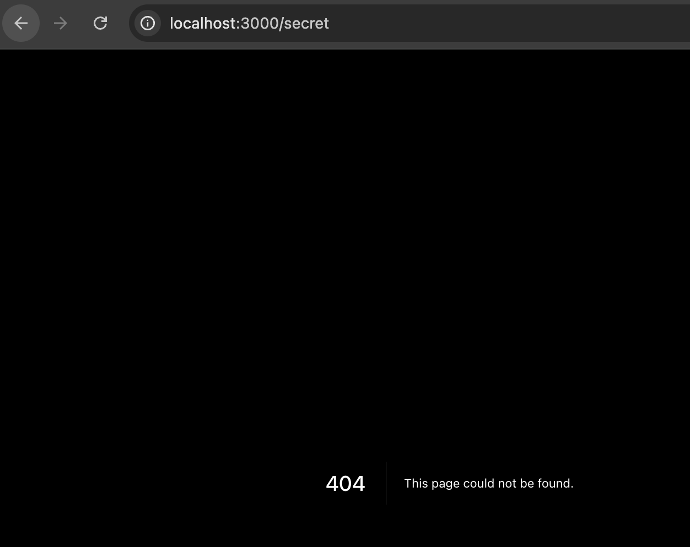

# Exercise 01 — 3-page App Router mini-site

> **Date:** 2026-05-25 | **Session #:** 3 | **Duration:** —
> **Roadmap:** Phase 1 → File-based Routing in practice
> **Stream:** ✅ Streamed ([YouTube link])

We pick up exactly where session 2 ended. One route, no navigation, a component
that says "Hello Next JS". Goal by the end: three pages with shared layout, all
wired by folder structure alone — zero router config.

---

## Starting point

```
app/
├── globals.css
├── favicon.ico
├── layout.tsx   ← Geist fonts, {children} bare in <body>
└── page.tsx     ← renders <Component /> → "Hello Next JS"
```

Real `layout.tsx` going in:

```tsx
export default function RootLayout({ children }: ...) {
  return (
    <html lang="en" className={`${geistSans.variable} ${geistMono.variable} h-full antialiased`}>
      <body className="min-h-full flex flex-col">{children}</body>
    </html>
  );
}
```

No navigation. No `<main>`. This is what we edit.

---

## Step 1. Create `/about` — the minimal case

Before touching `layout.tsx`, let's answer the main question: **what does it take
to add a route in App Router?**

Create the folder and file:

```
app/about/page.tsx
```

```tsx
export default function AboutPage() {
  return <h1>About</h1>
}
```

Open `http://localhost:3000/about` — it works. That's it. No config, no imports.
The folder name is the URL segment, `page.tsx` makes it public.

**Key insight:** A folder without `page.tsx` is *not* a route. Create
`app/secret/` with no file inside — `localhost:3000/secret` returns 404.
Next.js only exposes folders that have `page.tsx` (or `route.ts` for APIs).

> What is the API routes?
> We'll cover this in Phase 3: Data Fetching. For now just know that `route.ts` is like `page.tsx` but for APIs — it doesn't render UI, it handles HTTP methods.

---

## Step 2. Why navigation goes in `layout.tsx`

At this point we have two routes but no way to move between them. Obvious place
for a `<nav>` — but where?

**Option A: in every `page.tsx`** — means copy-pasting the same `<nav>` into
`page.tsx`, `app/about/page.tsx`, `app/projects/page.tsx`. Add a fourth route
later — paste again. Change one link — change it in three files.

**Option B: in `layout.tsx` once** — `layout.tsx` wraps every page in its
subtree. One file, always on screen.

**Practical proof right now:** temporarily add a visible timestamp to `layout.tsx`:

```tsx
<body className="min-h-full flex flex-col">
  <p style={{ fontSize: 10, padding: 4 }}>layout at: {new Date().toISOString()}</p>
  <nav ...>
```

Navigate between pages with `<a href>` — the timestamp updates every click.
That's a **full page reload** (`<a href>` always reloads). So with `<a href>`,
the layout re-renders every time just like everything else.

The "layout persists without re-rendering" property is real — but it only kicks in
with **client-side navigation** (`<Link>`). We'll see that in session 4: switch
`<a href>` → `<Link>`, repeat the test, and the timestamp will stay frozen
while only `<main>` swaps.

For now the practical reason nav goes in `layout.tsx` is simple: **single source
of truth**. Delete the timestamp line when done.

Add navigation to `layout.tsx`:

```tsx
// app/layout.tsx — diff: added <nav>, wrapped children in <main>, updated metadata

export const metadata: Metadata = {
  title: "Next.js 01",                        // was "Create Next App"
  description: "Learning Next.js App Router",
};

export default function RootLayout({ children }: ...) {
  return (
    <html lang="en" className={`${geistSans.variable} ${geistMono.variable} h-full antialiased`}>
      <body className="min-h-full flex flex-col">
        <nav className="flex gap-6 px-6 py-3 border-b border-zinc-200 dark:border-zinc-800 text-sm font-medium">
          <a href="/" className="hover:underline">Home</a>
          <a href="/about" className="hover:underline">About</a>
          <a href="/projects" className="hover:underline">Projects</a>
        </nav>
        <main className="flex flex-col flex-1">{children}</main>
      </body>
    </html>
  );
}
```

`<a href>` for now — replaced with `<Link>` in session 4 when we cover navigation properly.

---

## Step 3. Update `page.tsx` — replace the demo component

The old `<Component />` was just for testing absolute imports (session 2). Replace it:

```tsx
// app/page.tsx
export default function Home() {
  return (
    <div className="flex flex-col flex-1 items-center justify-center gap-4 bg-zinc-50 font-sans dark:bg-black">
      <h1 className="text-3xl font-bold">Welcome</h1>
      <p className="text-zinc-600 dark:text-zinc-400 max-w-sm text-center">
        A mini-site built with Next.js App Router — file-based routing in action.
      </p>
      <div className="flex gap-4 text-sm">
        <a href="/about" className="underline hover:text-zinc-900 dark:hover:text-zinc-100">About</a>
        <a href="/projects" className="underline hover:text-zinc-900 dark:hover:text-zinc-100">Projects</a>
      </div>
    </div>
  );
}
```

---

## Step 4. Flesh out `/about`

```tsx
// app/about/page.tsx
export default function AboutPage() {
  return (
    <div className="flex flex-col flex-1 items-center justify-center gap-4 font-sans">
      <h1 className="text-3xl font-bold">About Me</h1>
      <p className="text-zinc-600 dark:text-zinc-400 max-w-md text-center">
        Learning Next.js App Router in public — building real projects one session at a time.
      </p>
      <p className="text-zinc-600 dark:text-zinc-400 max-w-md text-center">
        Each session is streamed live on YouTube and documented in this repository.
      </p>
    </div>
  );
}
```

---

## Step 5. Create `/projects`

```tsx
// app/projects/page.tsx
const projects = [
  { name: "next_silence_note", description: "Next.js learning knowledge base, streamed on YouTube" },
  { name: "postgres_silence_note", description: "PostgreSQL learning knowledge base" },
  { name: "nextjs_01", description: "First App Router mini-site — Exercise 01" },
];

export default function ProjectsPage() {
  return (
    <div className="flex flex-col flex-1 items-center justify-center gap-6 font-sans">
      <h1 className="text-3xl font-bold">My Projects</h1>
      <ul className="flex flex-col gap-2">
        {projects.map((p) => (
          <li key={p.name} className="text-zinc-700 dark:text-zinc-300">
            <span className="font-medium">{p.name}</span> — {p.description}
          </li>
        ))}
      </ul>
    </div>
  );
}
```

---

## Step 6. Add `loading.tsx` to `/projects`

Next.js has a built-in Suspense slot: drop `loading.tsx` next to `page.tsx` in
the same folder. Next.js automatically wraps `page.tsx` in `<Suspense>` and shows
`loading.tsx` while it resolves.

```tsx
// app/projects/loading.tsx
export default function Loading() {
  return (
    <div className="flex flex-1 items-center justify-center font-sans">
      <p className="text-zinc-500">Loading projects...</p>
    </div>
  );
}
```

With a synchronous component like ours, `loading.tsx` never actually shows — the
page renders instantly. To see it work, add an artificial delay:

```tsx
// app/projects/page.tsx — temporary test
async function getProjects() {
  await new Promise((r) => setTimeout(r, 2000)); // fake 2s fetch
  return projects;
}
```

Then remove the delay. The point is: the file exists and the wiring is automatic.

> **Why `loading.tsx` here and not `about`?** Just to demonstrate the pattern.
> In real code you'd add it wherever there's a real async operation (DB query, API call).

---

## What we learned about special filenames

We only used two today: `page.tsx` and `layout.tsx`. Here's the full set that
Next.js recognises inside any route segment — useful as a reference after doing
the exercise:

| File | What it does |
|------|-------------|
| `page.tsx` | Makes the folder a URL; renders the page UI |
| `layout.tsx` | Wraps children, **persists** across navigations |
| `loading.tsx` | Suspense fallback — shown while page resolves |
| `error.tsx` | Error boundary — must be `'use client'` (React requirement) |
| `not-found.tsx` | Shown by `notFound()` or unmatched URL |
| `route.ts` | API endpoint — no UI, handles HTTP methods |
| `template.tsx` | Like layout but **remounts** on every navigation |
| `default.tsx` | Fallback for parallel routes |

The ones we haven't used yet will come naturally — `error.tsx` and `not-found.tsx`
in session 4, `route.ts` when we hit APIs.

---

## Final structure

```
app/
├── layout.tsx          ← nav + <main>{children}</main>
├── page.tsx            ← "/"
├── globals.css
├── favicon.ico
├── about/
│   └── page.tsx        ← "/about"
└── projects/
    ├── page.tsx        ← "/projects"
    └── loading.tsx     ← Suspense fallback
```

Three routes. Zero router config. The folder name is the URL.

---

## Pomodoros

| # | Duration | Focus |
|---|----------|-------|
| 1 | 25 min   | Steps 1–3: first route, layout nav, home page |
| 2 | 25 min   | Steps 4–6: about, projects, loading.tsx |

---

## Checklist

- [x] Adding a route = creating a folder with `page.tsx` — no config
- [x] Folder without `page.tsx` is not a route (404)
- [x] `layout.tsx` persists across navigations → right place for nav
- [x] Root Layout owns `<html>` + `<body>` — no other file adds these tags
- [x] `loading.tsx` = automatic Suspense boundary, no setup needed
- [x] `error.tsx` must be `'use client'` — React requires error boundaries to be client components

## Mistakes This Session

-

## What's Next

- [ ] Session 4 → Linking and Navigating — `<Link>`, `useRouter`, `redirect()`, `notFound()`
- [ ] Replace all `<a href>` in the mini-site with `<Link>`
