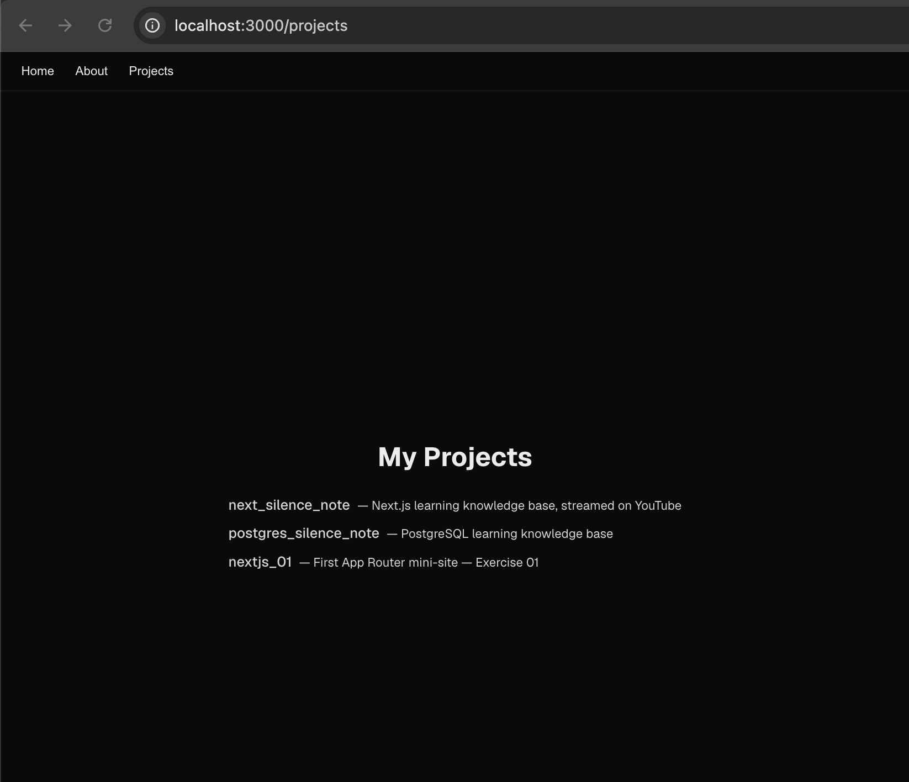
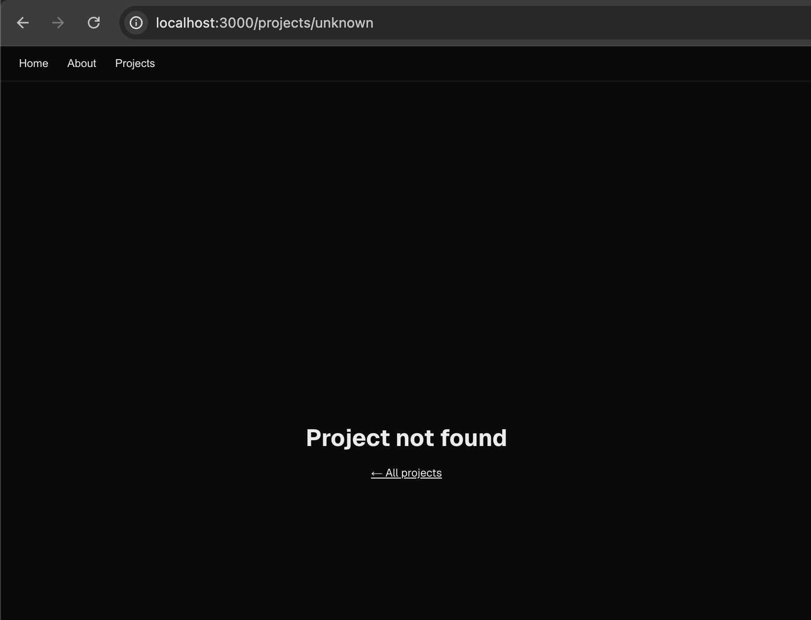
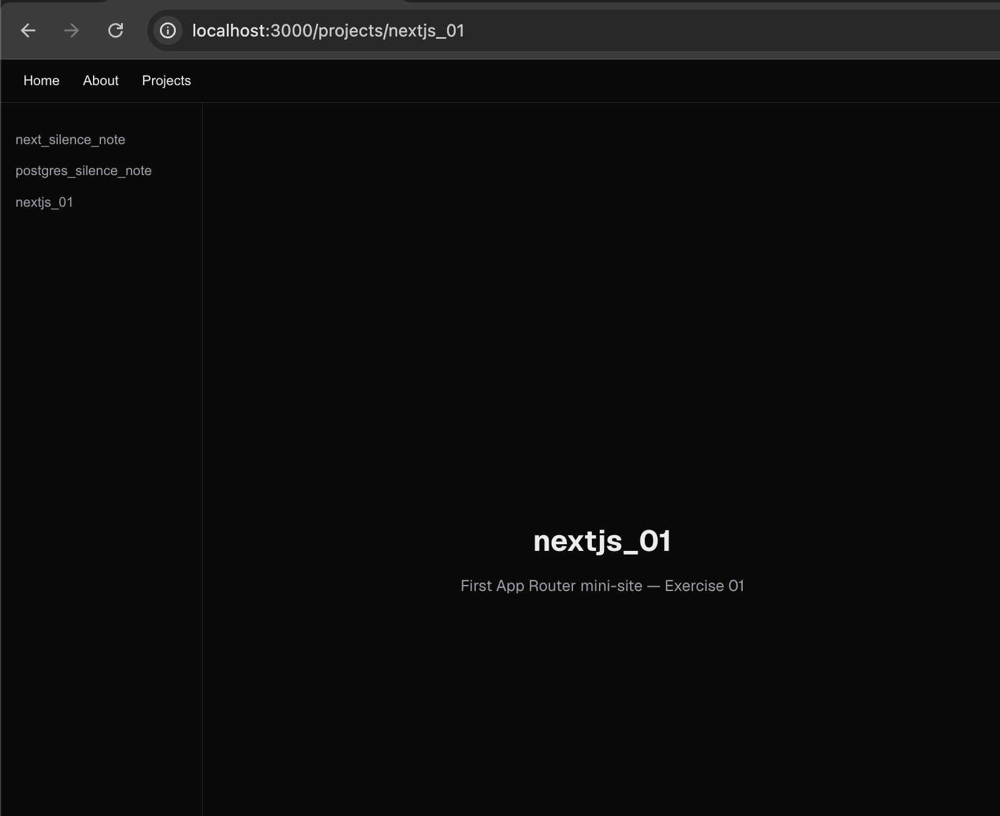

# Nested Routes, Dynamic Segments, and Layouts

> **Date:** 2026-05-26 | **Session #:** 4 | **Duration:** —
> **Roadmap:** Phase 1 → Layouts and Pages (continued)
> **Docs:** [nextjs.org/docs/app/getting-started/layouts-and-pages](https://nextjs.org/docs/app/getting-started/layouts-and-pages)
> **Stream:** ⬜ Not streamed ([YouTube link])

Session 3 built a flat 3-page site. Today we add depth: individual project pages
via `[slug]`, shared sidebar navigation via a nested layout, and typed params.

---

## Starting point

> Let's remove the `secret` folder from the previous session — it was just to illustrate that a folder without `page.tsx` is not a route. We won't need it anymore.

```
app/
├── layout.tsx          ← root layout (nav)
├── page.tsx            ← "/"
├── globals.css
├── favicon.ico
├── about/
│   └── page.tsx        ← "/about"
└── projects/
    └── page.tsx        ← "/projects" — inline list of 3 projects
src/
└── components/
    └── Component.tsx
```

Goal: `/projects` stays — plus each project gets its own page at `/projects/[slug]`.

---

## Step 1. Move projects data to a shared module

Both `projects/page.tsx` (list) and `projects/[slug]/page.tsx` (detail) will need
the same data. Extract it once:

```ts
// src/lib/projects.ts
export const projects = [
  {
    slug: "next_silence_note",
    name: "next_silence_note",
    description: "Next.js learning knowledge base, streamed on YouTube",
  },
  {
    slug: "postgres_silence_note",
    name: "postgres_silence_note",
    description: "PostgreSQL learning knowledge base",
  },
  {
    slug: "nextjs_01",
    name: "nextjs_01",
    description: "First App Router mini-site — Exercise 01",
  },
];

export function getProject(slug: string) {
  return projects.find((p) => p.slug === slug) ?? null;
}
```

With `baseUrl: "src/"` in `tsconfig.json`, both pages import as `from 'lib/projects'`.

```json
// tsconfig.json
  "baseUrl": "src/",
  "paths": {
    "@/components/*": ["components/*"],
    "@/lib/*": ["lib/*"],
  }
```

Update `app/projects/page.tsx` to use the shared module. Note `key={p.slug}`: `slug` is the stable unique identifier now.

```tsx
// app/projects/page.tsx — after Step 1
import { projects } from 'lib/projects';

export default function ProjectsPage() {
  return (
    <div className="flex flex-col flex-1 items-center justify-center gap-6 font-sans">
      <h1 className="text-3xl font-bold">My Projects</h1>
      <ul className="flex flex-col gap-2">
        {projects.map((p) => (
          <li key={p.slug} className="text-zinc-700 dark:text-zinc-300">
            <span className="font-medium">{p.name}</span>
            <span className="ml-2 text-sm">— {p.description}</span>
          </li>
        ))}
      </ul>
    </div>
  );
}
```

`/projects` still looks the same in the browser — the change is internal only.

---

## Step 2. Create the dynamic segment `/projects/[slug]`

A folder name in square brackets — `[slug]` — tells Next.js: this segment is dynamic,
capture whatever is in the URL and pass it as a param.

```
URL: /projects/nextjs_01
                └── slug = "nextjs_01"
```

```tsx
// app/projects/[slug]/page.tsx
import { getProject, projects } from 'lib/projects';
import { notFound } from 'next/navigation';

export function generateStaticParams() {
  return projects.map((p) => ({ slug: p.slug }));
}

export default async function ProjectPage(props: PageProps<'/projects/[slug]'>) {
  const { slug } = await props.params;
  const project = getProject(slug);

  if (!project) notFound();

  return (
    <div className="flex flex-col flex-1 items-center justify-center gap-4 font-sans">
      <h1 className="text-3xl font-bold">{project.name}</h1>
      <p className="text-zinc-600 dark:text-zinc-400 max-w-md text-center">
        {project.description}
      </p>
    </div>
  );
}
```

### `params` is a `Promise` in Next.js 15+

```tsx
// ✓ Next.js 15+ — params must be awaited
const { slug } = await props.params;

// ✗ Next.js 14 and below — no longer correct
const { slug } = props.params;
```

### `PageProps<'/projects/[slug]'>` — global type helper

Generated by `next dev`/`next build`, globally available — **no import needed**.
Infers `params` and `searchParams` types from the actual route path.

```tsx
// ✓ Recommended — typed from route path
props: PageProps<'/projects/[slug]'>
// slug is inferred as string ✓

// ✓ Also valid — manual typing
{ params }: { params: Promise<{ slug: string }> }
```

### `generateStaticParams` — list known slugs

Tells Next.js which slugs exist at build time → pre-rendered as static HTML.
Unknown slugs still work but fall back to dynamic rendering.
Covered in depth later in Phase 3: Data Fetching — "Static vs Dynamic rendering — generateStaticParams, dynamic = 'force-dynamic'".

Also let's add a link to the project detail page from the list on `/projects` — we'll wrapp the name `<span>` with a `<a>`.

```tsx
// app/projects/page.tsx — diff from Step 1
<li key={p.slug} className="text-zinc-700 dark:text-zinc-300">
  <a href={`/projects/${p.slug}`}><span className="font-medium">{p.name}</span> — {p.description}</a>
</li>
```



Now you can navigate to `/projects/nextjs_01` → the project detail page appears. The root nav is still there, but the projects list is replaced by the project detail.

---

## Step 3. Handle unknown slugs with `notFound()`

If `getProject(slug)` returns `null` → `notFound()` fires (already in the code above).
This triggers the nearest `not-found.tsx`.

Add a segment-level `not-found.tsx` scoped to `/projects/*`:

```tsx
// app/projects/not-found.tsx
export default function ProjectNotFound() {
  return (
    <div className="flex flex-col flex-1 items-center justify-center gap-4 font-sans">
      <h1 className="text-3xl font-bold">Project not found</h1>
      <a href="/projects" className="text-sm underline">
        ← All projects
      </a>
    </div>
  );
}
```

Go to `/projects/unknown` — this page appears with the root nav intact.



---

## Step 4. Add a nested layout — sidebar that persists across project pages

Now we have the route `/projects/[slug]`. The
obvious next question: **how do I navigate between project pages?**

The one possible answer is **add a sidebar**: for this we will use a nested layout. A `layout.tsx` inside `app/projects/[slug]` wraps only the `/projects/[slug]` subtree —
not `/projects` itself. Put the project navigation sidebar there — it appears on every
individual project page automatically, but not on the projects list.

```tsx
// app/projects/[slug]/layout.tsx
import { projects } from 'lib/projects';

export default function ProjectsLayout({ children }: { children: React.ReactNode }) {
  return (
    <div className="flex flex-1">
      <nav className="w-52 shrink-0 border-r border-zinc-200 dark:border-zinc-800 py-6 px-4 flex flex-col gap-1">
        {projects.map((p) => (
          <a
            key={p.slug}
            href={`/projects/${p.slug}`}
            className="text-sm text-zinc-600 dark:text-zinc-400 hover:text-zinc-900 dark:hover:text-zinc-100 py-1 hover:underline"
          >
            {p.name}
          </a>
        ))}
      </nav>
      <div className="flex flex-col flex-1">{children}</div>
    </div>
  );
}
```

The full layout stack now:

```
RootLayout (app/layout.tsx)
  └── html, body, top nav
        ├── projects/page.tsx          ← "/projects" — no sidebar
        └── ProjectsLayout (app/projects/[slug]/layout.tsx)
              └── sidebar | {children}
                            └── [slug]/page.tsx   ← "/projects/nextjs_01" etc.
```

Navigate from `/projects` to `/projects/nextjs_01` — the sidebar stays mounted.
Only the right-hand content area swaps. This is the real value of nesting layouts.



---

## Final structure

```
app/
├── layout.tsx              ← root layout (top nav)
├── page.tsx                ← "/"
├── globals.css
├── favicon.ico
├── about/
│   └── page.tsx            ← "/about"
└── projects/
    ├── page.tsx            ← "/projects" — list with links
    ├── not-found.tsx       ← custom 404 for /projects/* (new)
    └── [slug]/
        ├── layout.tsx      ← sidebar with project links (new)
        └── page.tsx        ← "/projects/nextjs_01" etc. (new)
src/
├── components/
│   └── Component.tsx
└── lib/
    └── projects.ts         ← shared data (new)
```

---

## Checklist

- [x] Nested routes = nested folders — `projects/[slug]/page.tsx` → URL `/projects/nextjs_01`
- [x] `[slug]` = dynamic segment — Next.js captures the URL value as a param
- [x] `params` is `Promise<{ slug: string }>` in Next.js 15+ — must be `await`ed
- [x] `PageProps<'/projects/[slug]'>` — global type helper, no import, inferred from route
- [x] `notFound()` from `next/navigation` — triggers nearest `not-found.tsx`
- [x] Nested layout = shared UI for a subtree — appears when the need is clear, not before

## Mistakes This Session

-

## What's Next

- [ ] Session 5 → Linking and Navigating — `<Link>` mechanics, prefetching, `loading.tsx` fires for real з `/projects/[slug]`
- [ ] Session 6 → Route groups — `(group)` folders, організація без зміни URL
