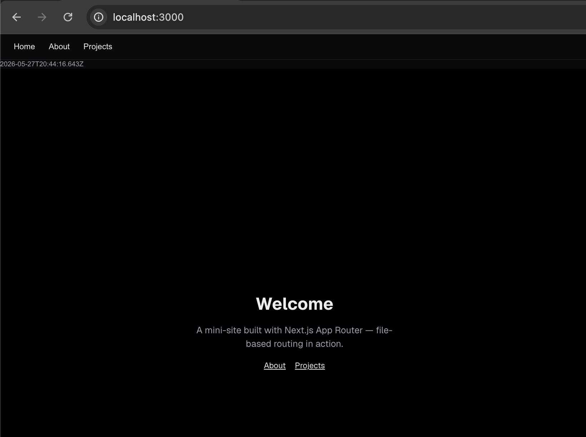
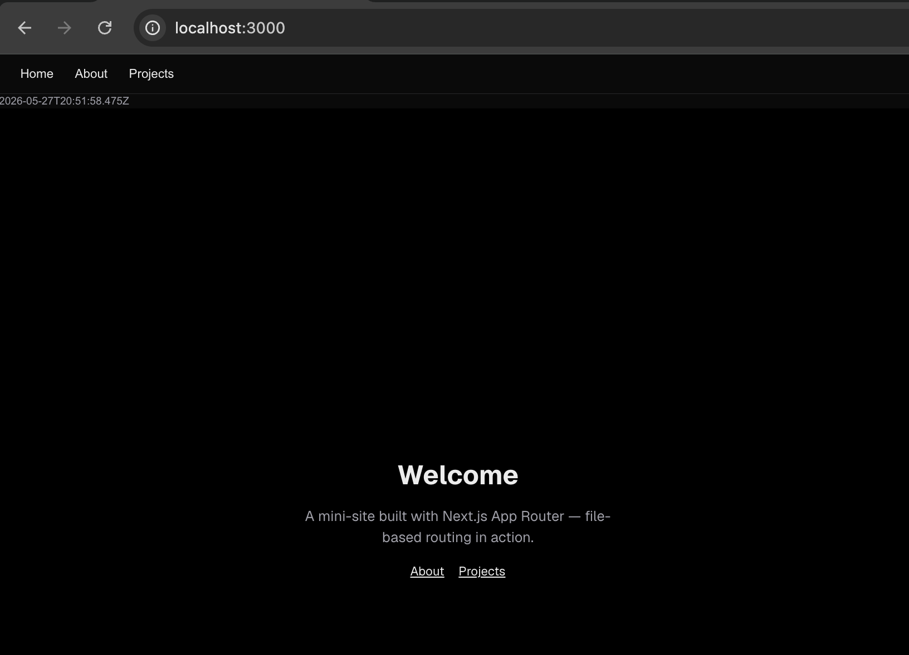
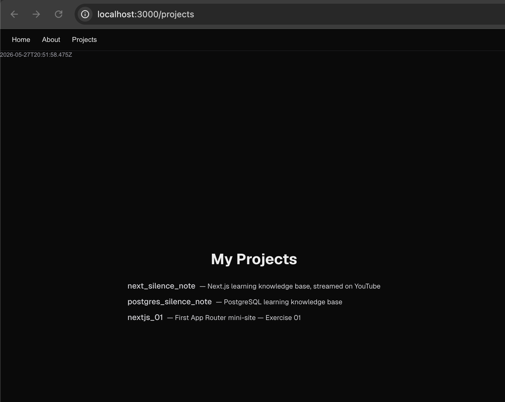
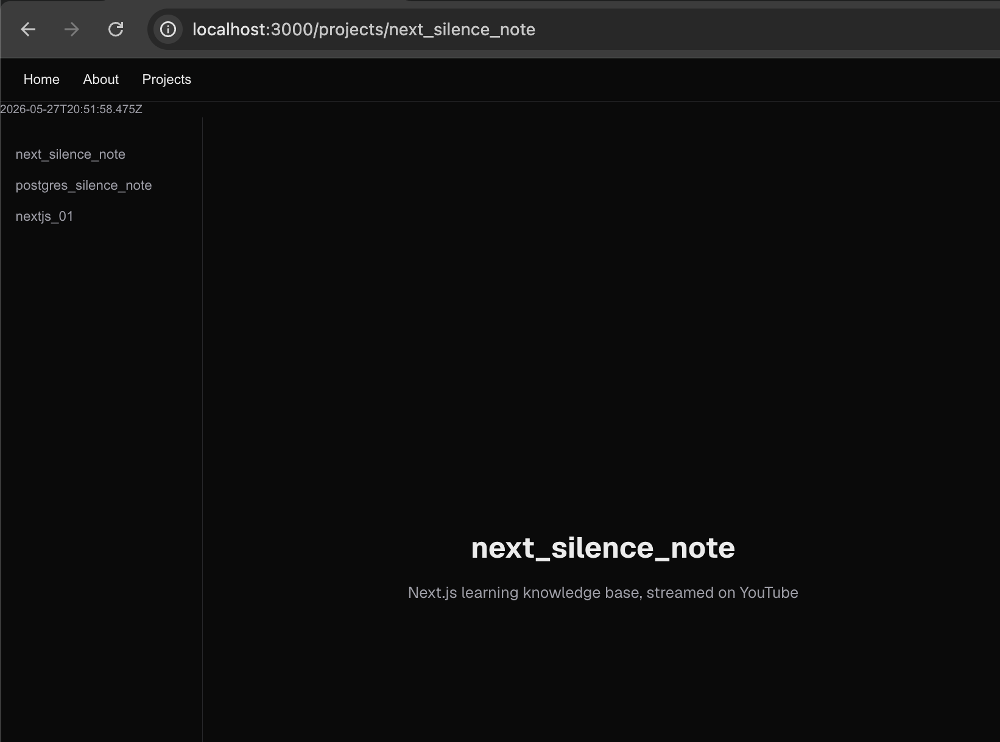
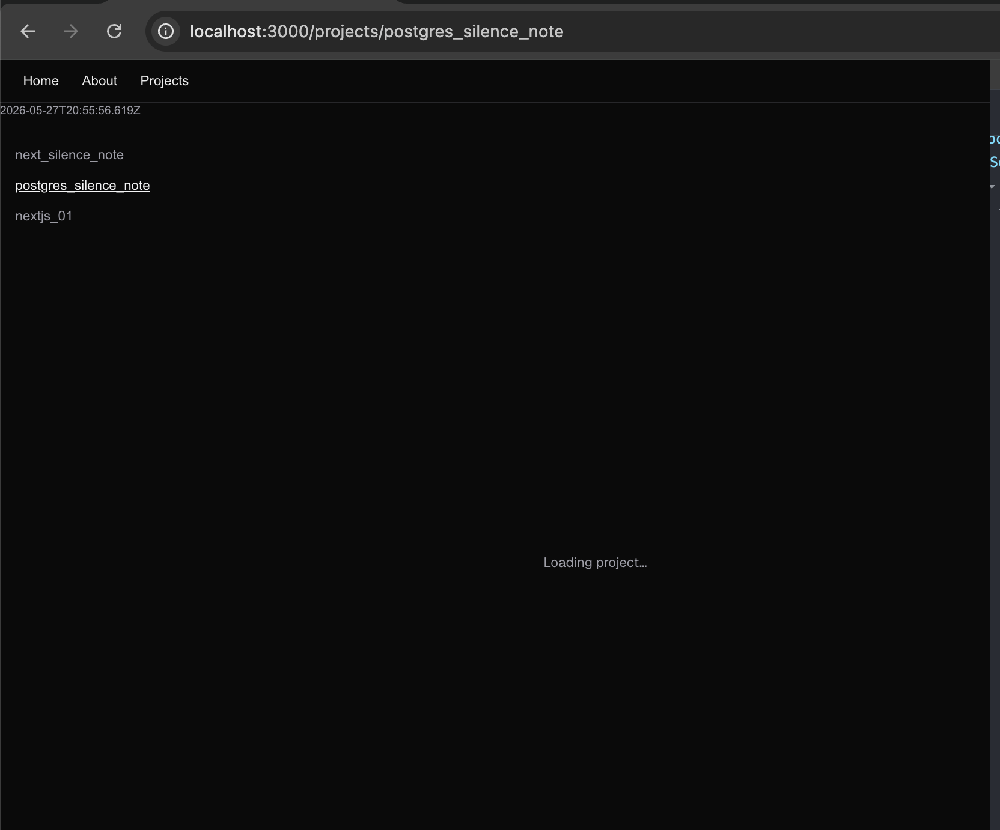

# Client-Side Navigation and Loading States

> **Date:** 2026-05-27 | **Session #:** 5 | **Duration:** —
> **Roadmap:** Phase 1 → Navigation — Link, devIndicators
> **Docs:** [nextjs.org/docs/app/getting-started/linking-and-navigating](https://nextjs.org/docs/app/getting-started/linking-and-navigating)
> **Stream:** ⬜ Not streamed ([YouTube link])

Session 4 built nested routes and a sidebar with `<a href>`. Today we replace those
plain anchors with `<Link>`, understand why it matters, and add a `loading.tsx` that
visibly fires when navigating to a dynamic route.

---

## Starting point

```
app/
├── layout.tsx              ← root layout (top nav) — still uses <a href>
├── page.tsx                ← "/"
├── globals.css
├── favicon.ico
├── about/
│   └── page.tsx            ← "/about"
└── projects/
    ├── page.tsx            ← "/projects" — list with <a href> links
    ├── not-found.tsx       ← custom 404 for /projects/*
    └── [slug]/
        ├── layout.tsx      ← sidebar with <a href> links
        └── page.tsx        ← "/projects/nextjs_01" etc.
src/
├── components/
│   └── Component.tsx
└── lib/
    └── projects.ts
```

Goal: replace all `<a href>` internal links with `<Link>`; add `loading.tsx` for
`/projects/[slug]`.

---

## Step 1. Prove that `<a href>` causes a full page reload

Before replacing anything, let's see what we're replacing — and why it matters.

Add a timestamp to `app/layout.tsx` so it's visible on every page:

```tsx
// app/layout.tsx — temporary, remove after the experiment
const timestamp = new Date().toISOString();

// inside JSX:
<span className="text-xs text-zinc-400">{timestamp}</span>
```

```tsx
// app/layout.tsx — temporary, remove after the experiment
export default function RootLayout({
  children,
}: Readonly<{
  children: React.ReactNode;
}>) {
  const timestamp = new Date().toISOString();
  return (
    <html lang="en" className={`${geistSans.variable} ${geistMono.variable} h-full antialiased`}>
      <body className="min-h-full flex flex-col">
        <nav className="flex gap-6 px-6 py-3 border-b border-zinc-200 dark:border-zinc-800 text-sm font-medium">
          <a href="/" className="hover:underline">Home</a>
          <a href="/about" className="hover:underline">About</a>
          <a href="/projects" className="hover:underline">Projects</a>
        </nav>
        <span className="text-xs text-zinc-400">{timestamp}</span>
        <main className="flex flex-col flex-1">{children}</main>
      </body>
    </html>
  );
}
```

Navigate between pages using the existing `<a href>` links. The timestamp changes on
every click — the entire page is re-fetched, the React tree is destroyed and rebuilt,
and the layout remounts from scratch.




Now imagine a heavy layout — analytics, auth state, open modals. A full reload kills
all of it.

Remove the timestamp after confirming. `<Link>` is the fix.

---

## Step 2. Replace `<a href>` with `<Link>`

`<Link>` from `next/link` handles navigation client-side: only the changed page
segment re-renders, the layout stays mounted, and Next.js prefetches the target in
the background.

Replace in three places:

```tsx
// app/layout.tsx — top nav
+ import Link from 'next/link';

- <a href="/">Home</a>
- <a href="/about">About</a>
- <a href="/projects">Projects</a>
+ <Link href="/">Home</Link>
+ <Link href="/about">About</Link>
+ <Link href="/projects">Projects</Link>
```

```tsx
// app/projects/page.tsx — projects list
+ import Link from 'next/link';

- <a href={`/projects/${p.slug}`}>...</a>
+ <Link href={`/projects/${p.slug}`}>...</Link>
```

```tsx
// app/projects/[slug]/layout.tsx — sidebar
+ import Link from 'next/link';

- <a href={`/projects/${p.slug}`} ...>
+ <Link href={`/projects/${p.slug}`} ...>
```

```tsx
// app/projects/not-found.tsx
+ import Link from 'next/link';

- <a href="/projects" className="text-sm underline">← All projects</a>
+ <Link href="/projects" className="text-sm underline">← All projects</Link>
```

Repeat the timestamp experiment — it no longer changes when navigating. The layout
stays mounted. Only the `{children}` slot swaps.






### Why layout stays mounted

Next.js renders only the segment that changed. The root `layout.tsx` is outside the
changed segment — React never unmounts it, so its state (scroll position, open
dropdowns, etc.) is preserved.

---

## Step 3. Prefetching

`<Link>` prefetches linked pages automatically when they appear in the viewport:

| Route type | What gets prefetched |
|------------|----------------------|
| Static (known at build time) | Full page HTML |
| Dynamic (`[slug]`) | Shared layout only, not the page content |

This means navigating to `/projects/nextjs_01` feels instant — the sidebar layout
is already cached. The page content itself loads on demand.

No code to write here — prefetching is on by default. To disable: `<Link prefetch={false}>`.

---

## Step 4. Add `loading.tsx` for `/projects/[slug]`

`/projects/[slug]` is a dynamic route — Next.js can't pre-render it without knowing
the slug. When you navigate there, there's a moment before the page renders.

`loading.tsx` next to a page wraps it in a `<Suspense>` boundary automatically.
While the page component is loading, the loading UI appears — and the layout
(sidebar) is already visible because it was prefetched.

```tsx
// app/projects/[slug]/loading.tsx
export default function ProjectLoading() {
  return (
    <div className="flex flex-col flex-1 items-center justify-center gap-4 font-sans">
      <p className="text-zinc-400 text-sm">Loading project…</p>
    </div>
  );
}
```

To make it visibly fire, add an artificial delay to the page (remove after testing):

```tsx
// app/projects/[slug]/page.tsx — temporary
await new Promise((r) => setTimeout(r, 3500));
```

Navigate to a project — the sidebar appears immediately, the content area shows
"Loading project…" for 3.5 s, then the page renders. Remove the delay after
confirming.



---

## Final structure

```
app/
├── layout.tsx              ← top nav — now uses <Link>
├── page.tsx
├── globals.css
├── favicon.ico
├── about/
│   └── page.tsx
└── projects/
    ├── page.tsx            ← list — now uses <Link>
    ├── not-found.tsx
    └── [slug]/
        ├── layout.tsx      ← sidebar — now uses <Link>
        ├── loading.tsx     ← loading UI (new)
        └── page.tsx
src/
├── components/
│   └── Component.tsx
└── lib/
    └── projects.ts
```

---

## Checklist

- [ ] `<a href>` = full reload — timestamp proves it
- [ ] `<Link>` = client-side transition — layout stays mounted, only changed segment re-renders
- [ ] Static routes prefetch full HTML; dynamic routes prefetch layout only
- [ ] `loading.tsx` wraps the page in `<Suspense>` — layout renders immediately, content waits
